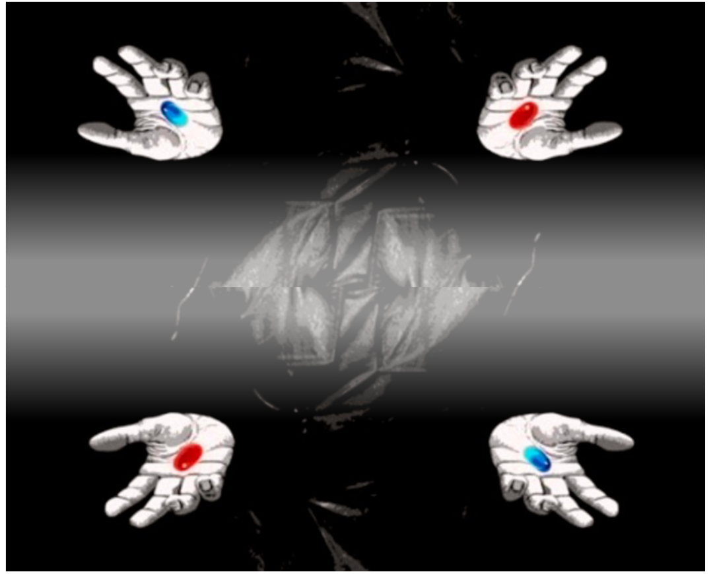

# ab-lab
## A python gameyard for statistical experimentation


<div style="text-align:center"></div>

Image adapted from [source](https://www.legalwatercoolerblog.com/2020/03/28/how-are-you-is-there-anything-i-can-do-to-help/)

##### **Q.** Will you take the blue or red pill? What about in a parallel world?
##### **A.** Let me run an A/B test first!


<br> Read the full story in this published Medium blog post:
[Link](https://towardsdatascience.com/global-warming-and-the-narrative-around-it-lessons-learned-from-nlp-exploration-of-reddit-posts-fb2918d500e9)
<br>

## Project Goal

- Make a generalized Workflow for conducting A/B on data with variable distribution and quality.
- Also, provide rather insightful and detailed observations from the test results.

## Workflow:

There are two classes of questions that we ask ourselves during an experimentation observation:

 - **Pre-test:** 
     - 1. What is the thing I am testing (hypothesis test)?
     - 2. Are my A and B groups distinct enough to be tested?
     - 3. What should be the experiment duration?
     - 4. What is the sample size that is required?
 
 - **Post-test:** 
     - 1. Do the observations QC pass?
     - 2. Accept/reject the Null hypothesis?
     - 3. More insights on the statistical differences?


## Problem statement
---
The dataset is from <br><br>
<i>**Can my model solve that ?**</i>

---


## Project structure
    
The import, data process, as well as modeling and visualizatons were all performed in python. The project directory is structured as follows:
```
project-global_warming_NLP
    
|__ assets/
|__ codes/
|   |__ P01_API_requests.ipynb  
|   |__ P02_Data_Cleaning.ipynb 
|   |__ P03_EDA_NLP.ipynb   
|   |__ P04_Modeling.ipynb
|   |__ P05_Select_Model_Analysis.ipynb
|   |__ P06_Select_Model_Test.ipynb    
|__ datasets/
|__ plots/
|__ Executive_slides_NLP_reddit.pdf
|__ README.md
```

The project was first run on a small dataset of only 500 imported posts, at the production stage, it was run on 10,000 posts.

---
### Instructions for running and reproducing the model results*
After cloning the repository, run the notebooks (under "codes/" directory) with the sequence that is laid out in the above project directory table. The figures will be automatically saved into "plots/" directory.     
  
---    
### <span style="color: green">Step 1 - Data collection
    
I wrote a python function to pull subreddits through API push shift.
    Then, using this function, I imported posts from two global warming and conspiracy theory subreddits. The imported posts date before July 1, 2020. Then, merged the two dataset as a pandas dataframe and saved them to CSV files.

---    
    
### <span style="color: green">Step 2 - Data cleaning
As expected from the unstructured text data, data cleaning is a labor-intensive part of any NLP project. To keep this Readme simple and easy to read, here I just enumerate the cleaning procedures with respect to performance sequence: removing all non-letter characters, string operations, removing stopwords, stemming, and finally stitching back the result back into the data frame and saving it as a CSV file.
    
---
### <span style="color: green"> Step 3 - EDA

    
Hence, I vectorized the text, making it production-ready to be fed into models...
    
---   
    
### <span style="color: green">Step 4 - Modeling process
During the modeling step,

### <span style="color: green">Model Discussion
    

- All models


### <span style="color: green">Step 5 - Evaluation and Conceptual Understanding
    
To further discuss


### <span style="color: green">Step 6 - Conclusion and Recommendations

In the following, we show the word use per year, it seems that the world is getting a better place to live in. That's good:

### <span style="color: green">Final recommendation points
    
    
Based on the presented workflow in this project.

